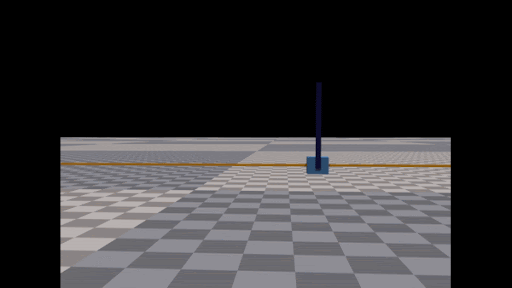

# Learned World Model Predictive Control Policy
Gogoro Env             |  Cartpole Env
:-------------------------:|:-------------------------:
  |  

This project aim to  create a new reinforcement learning algorythm to take the crown from PPO. It is as fast and  times more sample efficient and support constrainend optimisation.

## Dependency
This project depends on : 
<ul>
  <li>[Pytorch](https://pytorch.org/get-started/locally/), we higly sugest to install pytorch > 1.12 for the faster transformer inference.</li>
  <li>[Isaac-Gym](https://developer.nvidia.com/isaac-gym), preview 4 suggested.</li>
  <li>[IsaacGymEnvs](https://github.com/NVIDIA-Omniverse/IsaacGymEnvs), last master push. </li>
</ul>	

⚠️ This code was only tested using pytorch 2.0.1 and the Isaac Gym Preview 4.

## Install

### Linux

Go your install folder of IsaacGymEnvs, go in the subfolder isaacgymenvs and clone this project. That's all you need to do.
><code>cd IsaacGymEnvs/isaacgymenvs</code>
><code>git clone https://github.com/Ugo31/world_model_mpc.git</code>

### Mac OS and Windows 
I'm to poor to help you 

## Run

To run this you need to put yourself in the directory of this project (otherwise you will get errors for forlders not created because the code just assumes the folders are here)

><code>cd IsaacGymEnvs/isaacgymenvs/world_model_mpc</code>
><code>python3 main.py</code>

This will run the Cartpole code, for the gogoro code I need to clean the code.
